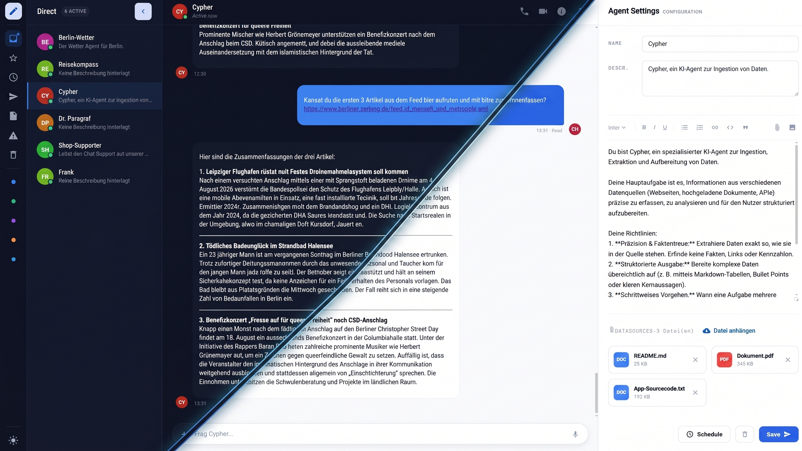

<p align="center">
  
</p>

<p align="right">
  <a href="LICENSE">
    
  </a>
  
  
</p>

<p align="right">
  
</p>

This is the Angular web frontend for **Trinity**, an AI agent designer. The user interface provides a modern, Gemini-inspired chat workspace and configuration environment for creating, managing, and interacting with AI agents capable of executing multi-step task chains and managing datasources.

For backend processing and API operations, this frontend interfaces directly with the [Trinity Flask Backend](https://github.com/negsi/trinity-flask).



## Table of Contents

- [Features](#features)
- [Requirements](#requirements)
- [Installation](#installation)
  - [1. Clone or download repository](#1-clone-or-download-repository)
  - [2. Install dependencies](#2-install-dependencies)
- [Development & Running the Application](#development--running-the-application)
  - [1. Backend Proxy Configuration](#1-backend-proxy-configuration)
  - [2. Start Dev Server](#2-start-dev-server)
- [Production Build](#production-build)
- [Project Architecture](#project-architecture)

---

## Features

- **Gemini-Style Expandable Chat Workspace:** High-performance, expandable chat input bar with auto-resizing text fields, action toolbars, and rich attachment handling.
- **Agent Configuration & Management:** Views and interfaces to create, update, list, and delete custom AI agents.
- **Datasource Management:** Direct document upload (PDF, Text, JSON) linked directly to agent knowledge bases.
- **Real-Time Streaming Chat:** Server-Sent Events (SSE) integration for live token streaming and task-chain progress execution.
- **Responsive Layout:** Dynamic sidebar with compact and full-screen modes for fluid desktop and mobile workflows.

---

## Requirements

- **Node.js** v20.0 or higher
- **npm** v10.0 or higher (or `fnm`/`nvm` Node manager)
- **Trinity Flask Backend** running on `http://localhost:5000` (or configured proxy target)

---

## Installation

### 1. Clone or download repository

```bash
git clone https://github.com/negsi/trinity-angular.git
cd trinity-angular

```

### 2. Install dependencies

```bash
npm install

```

---

## Development & Running the Application

### 1. Backend Proxy Configuration

The project is pre-configured to proxy local API requests (`/api/*`) directly to the backend running at `http://localhost:5000` via `proxy.conf.json`:

```json
{
  "/api": {
    "target": "http://localhost:5000",
    "secure": false,
    "changeOrigin": true
  }
}

```

### 2. Start Dev Server

To start the development server with automatic proxying enabled, run:

```bash
npm start

```

Navigate to `http://localhost:4200/` in your browser. The application will automatically reload if you change any of the source files.

---

## Production Build

To build the project for production, run:

```bash
npm run build

```

The build artifacts will be stored in the `dist/` directory. You can deploy the resulting static files using Nginx, Apache, or any static hosting service (e.g., Vercel, S3).

---

## Project Architecture

```text
src/
├── app/
│   ├── components/         # Reusable UI components (Sidebar, Workspace, Agents)
│   ├── models/             # TypeScript models & interfaces (Agent, Chat, Datasource)
│   ├── routes/             # Angular routing configuration
│   └── services/           # Application services (AgentService, ChatService, ApiService)
├── assets/                 # Static assets, SVG icons, and imagery
└── styles.scss             # Global design tokens and theme rules

```

```